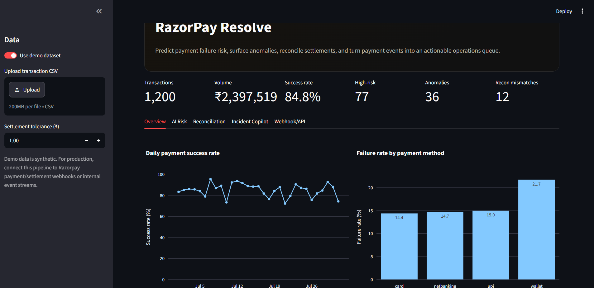
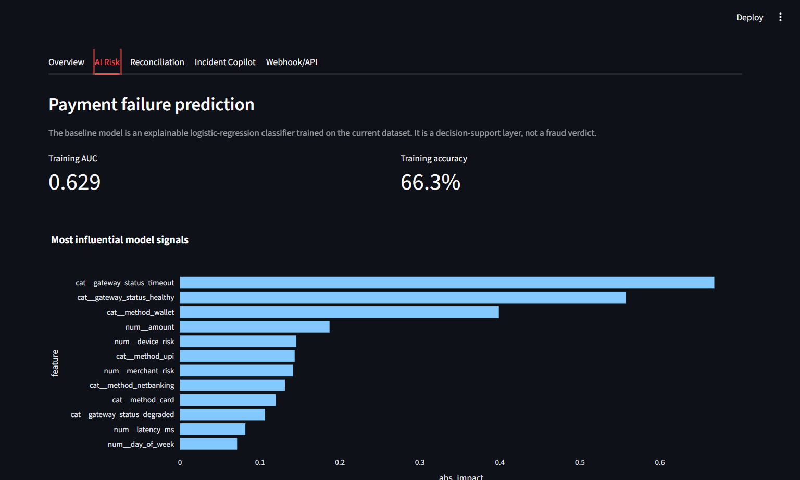
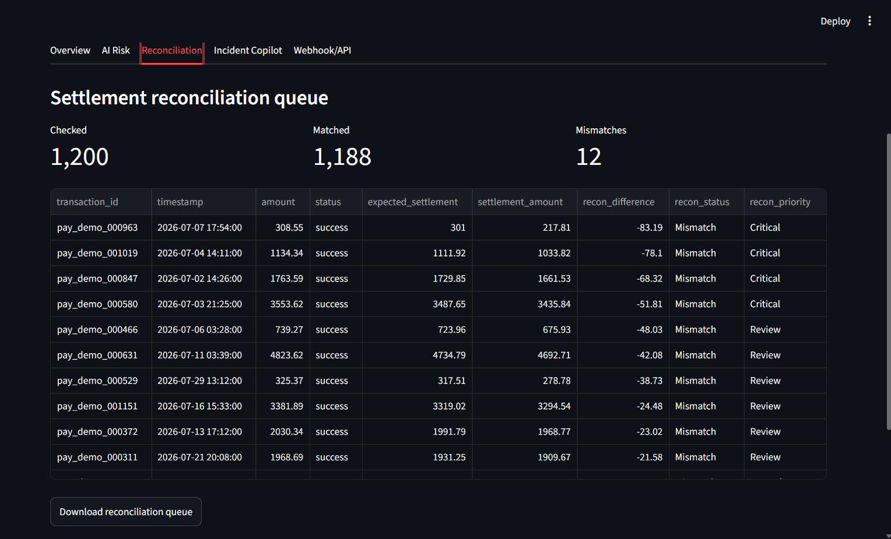
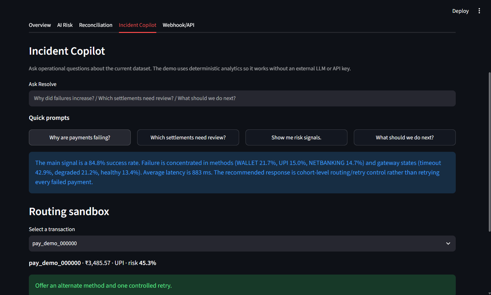
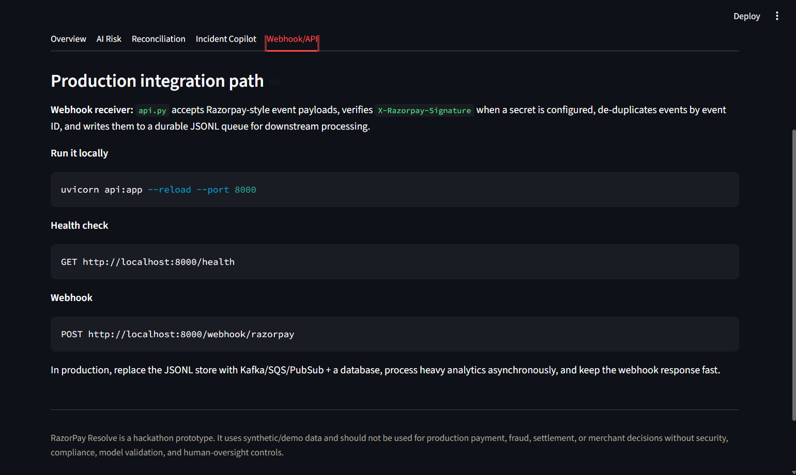

# RazorPay Resolve

**Open Track buildathon prototype — AI for payment reliability, reconciliation and merchant operations.**

**## 🚀 Product Preview**


**### Operations Dashboard**





**### AI Risk \& Explainability**





**### Settlement Reconciliation**





**### Incident Copilot**





**### Webhook/API Integration**




## 1\. The problem

Payment platforms have to do more than process a transaction. They must keep the payment journey reliable, explain failures, avoid harmful retry storms, identify unusual activity, and reconcile money from payment events to settlements.

RazorPay Resolve turns these operational signals into one decision layer:

1. **Predict** payment failure risk before the next retry.
2. **Detect** operational anomalies across amount, latency, retries, risk and settlement gaps.
3. **Reconcile** expected vs received settlement values.
4. **Recommend** the next action for a transaction or incident.
5. **Explain** patterns to an operations team using a deterministic local copilot.
6. **Ingest** Razorpay-style webhooks through a signature-aware FastAPI endpoint.

## 2\. Why it fits the Open Track

The Open Track asks builders to pick a real problem, use AI meaningfully and show something that works. Resolve is intentionally broader than a single dashboard: it is a proposed control plane for payment operations.

The AI is used for:

* supervised failure-risk prediction using logistic regression;
* unsupervised anomaly detection using Isolation Forest;
* explainable feature importance;
* deterministic incident reasoning that turns model/data signals into operational actions.

The prototype is intentionally runnable without an external LLM or paid API key.

## 3\. Architecture

```text
                         +----------------------+
                         | Razorpay Webhooks    |
                         | payment / settlement |
                         +----------+-----------+
                                    |
                                    v
                         +----------------------+
                         | FastAPI receiver     |
                         | signature + idempotency|
                         +----------+-----------+
                                    |
                                    v
                         +----------------------+
                         | Event / data layer   |
                         +----------+-----------+
                                    |
                 +------------------+------------------+
                 |                  |                  |
                 v                  v                  v
          Failure model      Anomaly detector     Reconciliation
          Logistic Reg.      Isolation Forest     expected vs actual
                 \\                  |                  /
                  \\                 |                 /
                   +----------------+----------------+
                                    |
                                    v
                         +----------------------+
                         | Resolve Decision     |
                         | risk + explanation   |
                         | + recommendation     |
                         +----------+-----------+
                                    |
                                    v
                         +----------------------+
                         | Streamlit Operations |
                         | dashboard / copilot  |
                         +----------------------+
```

## 4\. Project structure

```text
razorpay\_resolve/
├── app.py
├── api.py
├── requirements.txt
├── .env.example
├── README.md
├── data/
│   └── sample\_transactions.csv
├── src/
│   ├── \_\_init\_\_.py
│   ├── data\_engine.py
│   ├── ml\_engine.py
│   ├── reconciliation.py
│   └── insights.py
└── tests/
    └── test\_core.py
```

## 5\. Run the dashboard

### Windows

```bash
py -m venv .venv
.venv\\Scripts\\activate
pip install -r requirements.txt
streamlit run app.py
```

### macOS/Linux

```bash
python3 -m venv .venv
source .venv/bin/activate
pip install -r requirements.txt
streamlit run app.py
```

The app starts with a synthetic dataset, so no credentials are needed.

## 6\. Run the webhook gateway

In a second terminal:

```bash
uvicorn api:app --reload --port 8000
```

Health check:

```text
http://localhost:8000/health
```

Webhook endpoint:

```text
POST http://localhost:8000/webhook/razorpay
```

For a production-like setup, copy `.env.example` to `.env`, set a strong webhook secret, and set:

```text
ALLOW\_UNSIGNED\_DEMO\_WEBHOOKS=false
```

The receiver validates the HMAC SHA-256 signature in `X-Razorpay-Signature` and stores event IDs to prevent duplicate processing within the running process.

## 7\. CSV schema

The uploaded CSV should contain:

```text
transaction\_id
timestamp
amount
status
method
retry\_count
latency\_ms
device\_risk
merchant\_risk
gateway\_status
settlement\_amount
expected\_settlement
```

Example:

```text
pay\_001,2026-08-01 10:15:00,499,success,upi,0,520,0.08,0.04,healthy,488.02,488.02
pay\_002,2026-08-01 10:16:00,2999,failed,card,2,2480,0.52,0.12,degraded,0,2939.02
```

## 8\. Model design

### Failure prediction

A logistic-regression classifier estimates:

```text
P(payment failure | transaction context)
```

Features:

* amount
* retry count
* latency
* device risk
* merchant risk
* hour/day
* weekend flag
* payment method
* gateway status

Why logistic regression for the prototype?

* fast;
* easy to retrain;
* explainable;
* probability output is easy to consume in an operations queue.

For production, compare against gradient-boosted models and calibrate probabilities against time-based validation.

### Anomaly detection

Isolation Forest flags transactions that are unusual across:

* amount;
* latency;
* retries;
* device risk;
* merchant risk;
* settlement gap.

An anomaly is not automatically fraud. It is a reason to investigate.

### Reconciliation

For each successful transaction:

```text
reconciliation\_difference =
    settlement\_amount - expected\_settlement
```

Records beyond the configured tolerance become review items.

## 9\. Operational recommendation engine

The current prototype uses transparent rules on top of model/data signals.

Examples:

* gateway timeout or very high latency → route away from degraded path and use controlled backoff;
* high failure risk + repeated retries → stop blind retries and offer an alternate payment method;
* medium risk → one controlled retry plus an alternate method;
* low risk → normal flow.

This makes the demo understandable to judges and gives a clear path toward a learned policy/routing engine later.

## 10\. How this can help Razorpay

### A. Payment reliability

Razorpay can aggregate failure risk by:

* payment method;
* bank/issuer;
* gateway/acquirer path;
* merchant segment;
* time of day;
* geography;
* error code.

Instead of reacting after a spike, operations can detect deteriorating cohorts earlier.

### B. Smarter retries

Repeated retries can create load without increasing successful payments. Resolve can support a policy such as:

```text
high risk + degraded gateway
        ↓
avoid immediate retry
        ↓
alternate method / controlled backoff
```

This can reduce unnecessary retry traffic and improve customer experience.

### C. Settlement operations

Settlement exceptions can be auto-ranked by financial impact and age. The ops team sees:

```text
transaction → expected amount → received amount → difference → priority
```

The next version should join this with settlement IDs/UTRs and merchant-level ledgers.

### D. Merchant support

Instead of telling a merchant only that a payment failed, support can receive:

```text
What happened
Why it likely happened
Which cohort is affected
What action is recommended
What evidence supports the recommendation
```

This reduces time-to-diagnosis.

### E. Incident management

The same event stream can become an early-warning system for:

* gateway degradation;
* bank/issuer downtime;
* webhook delivery failures;
* abnormal failure spikes;
* settlement processing issues.

## 11\. Why the webhook design matters

Razorpay's public documentation describes webhooks for payment, settlement and other events. The platform recommends using webhooks for asynchronous automation and supplementing them with API verification when an immediate user-facing decision is required.

Resolve follows that architecture:

* accept event;
* verify signature;
* deduplicate;
* persist quickly;
* perform heavier analytics asynchronously.

Reference:
https://razorpay.com/docs/webhooks/

## 12\. Production roadmap

### Phase 1 — Hackathon demo

* synthetic data;
* local ML;
* Streamlit dashboard;
* FastAPI webhook receiver.

### Phase 2 — Internal pilot

* connect to real event streams;
* use time-based train/validation splits;
* add bank/issuer/error-code dimensions;
* add merchant-level alerting;
* store features and predictions.

### Phase 3 — Decisioning

* real-time risk service;
* calibrated probability thresholds;
* smart routing experiments;
* controlled retry policy;
* human approval for high-impact decisions.

### Phase 4 — Platform scale

* Kafka/PubSub/SQS event backbone;
* feature store;
* model registry;
* online inference;
* drift monitoring;
* audit logs;
* SLOs and rollback controls.

## 13\. Safety, compliance and model governance

This prototype is not a production fraud engine. Before deployment:

* never expose payment credentials or secrets in logs;
* minimise sensitive customer data;
* validate webhook signatures;
* make webhook handling idempotent;
* encrypt data at rest and in transit;
* implement access control and audit trails;
* validate models for false positives/false negatives;
* monitor drift;
* retain human review for high-impact actions;
* test failure modes and rollback paths.

## 14\. Demo script for judges

**0:00–0:30 — Problem**

"Payment success is not the end of payment infrastructure. When failures, retries, anomalies and settlements diverge, operations teams have to stitch together multiple signals."

**0:30–1:30 — Show the dashboard**

Load the synthetic data. Point out:

* success rate;
* high-risk transactions;
* anomalies;
* settlement mismatches.

**1:30–2:30 — Show AI**

Open AI Risk:

* show failure probability;
* show influential signals;
* explain that the model is trained locally and produces an actionable risk queue.

**2:30–3:30 — Show the copilot**

Ask:

* "Why are payments failing?"
* "Which settlements need review?"
* "What should we do next?"

**3:30–4:30 — Show webhook architecture**

Run FastAPI and explain:

* signature validation;
* idempotency;
* fast acknowledgement;
* asynchronous downstream processing.

**4:30–5:00 — The vision**

"Resolve turns raw payment events into a reliability control plane: predict, explain, reconcile and act."

## 15\. Limitations of the prototype

* Demo data is synthetic.
* The model is trained and evaluated on the same dataset for demonstration; production must use time-based holdout validation.
* The rule-based copilot is not a general-purpose LLM.
* The JSONL webhook store is for demonstration only.
* No real payment routing or financial action is executed.
* No customer PII is required by the demo.

## 16\. Suggested future metrics

Measure the product with business outcomes, not only model accuracy:

```text
Payment success uplift
Retry reduction
Mean time to detect incident
Mean time to resolve incident
Settlement exception resolution time
False-positive rate
Merchant support resolution time
Webhook processing latency
Webhook duplicate-processing rate
```

## 17\. One-line pitch

**"RazorPay Resolve is an AI payment-operations control plane that predicts failures before retries, catches anomalies, reconciles settlements, and tells teams what to do next."**

